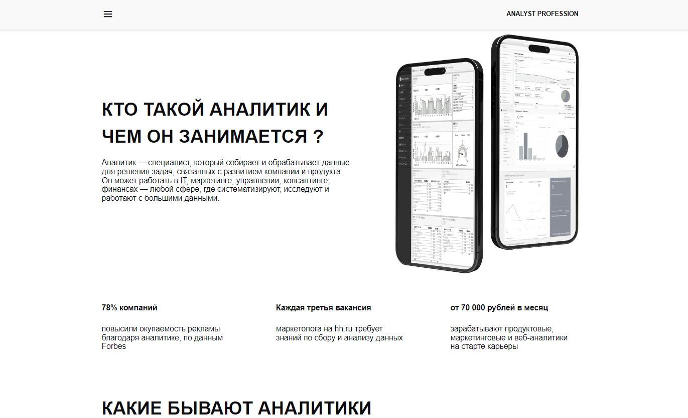
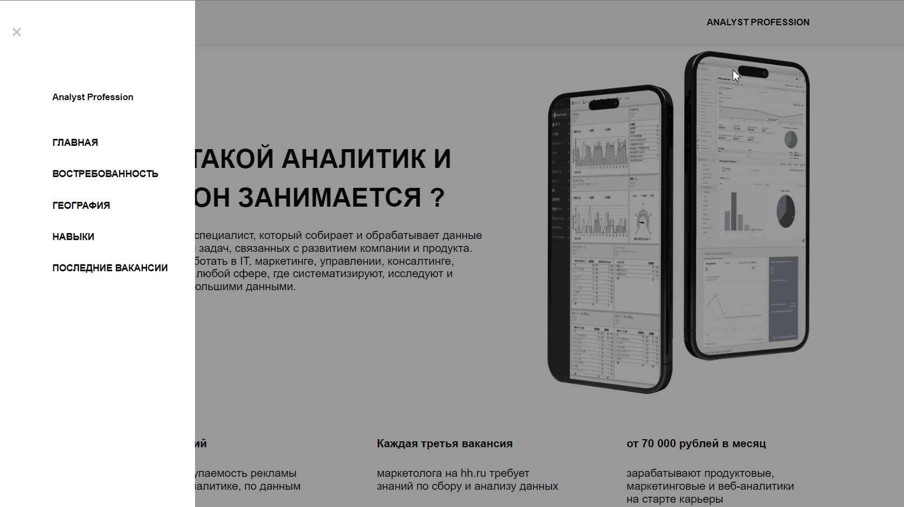
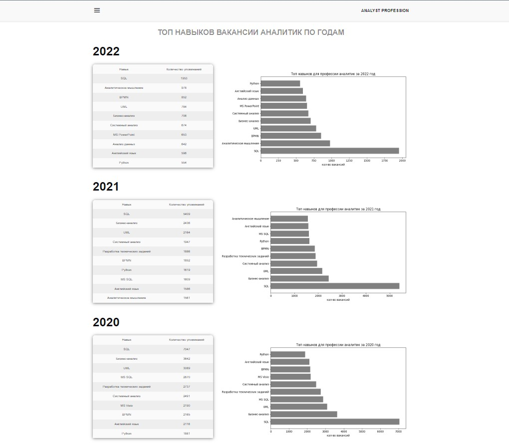
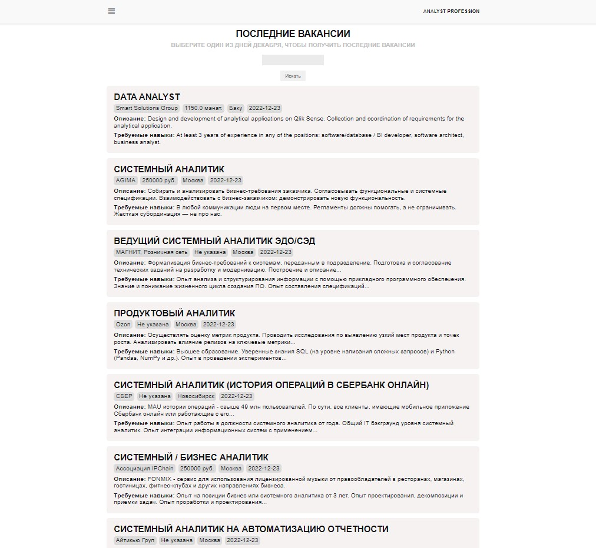
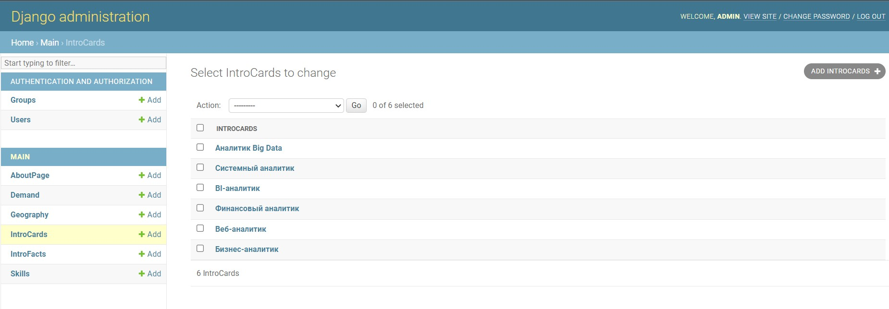

<h1>Analyst Profession</h1>

<a href="https://dmitryovechkin.pythonanywhere.com/">Analyst Profession</a>
предоставляет полную информацию о профессии аналитик.

<h3>Главная</h3>

<h3>Страницы с данными статистики (страница навыков)<h3>

<h3>Страница запроса данных за декабрь по вакансии Аналитик<h3>

<h3 style='text-align: center;'>Также присутсвует CRUD система администирования приложение всех страниц для всех элементов<h3>
